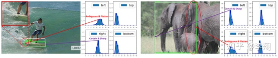
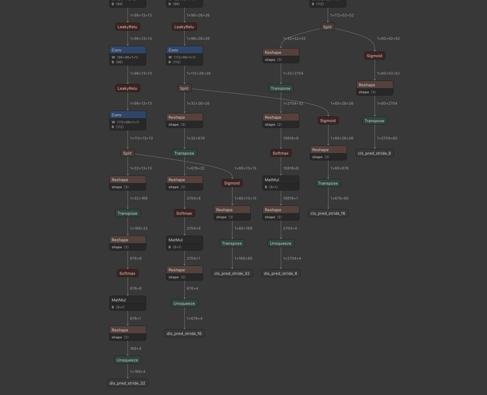
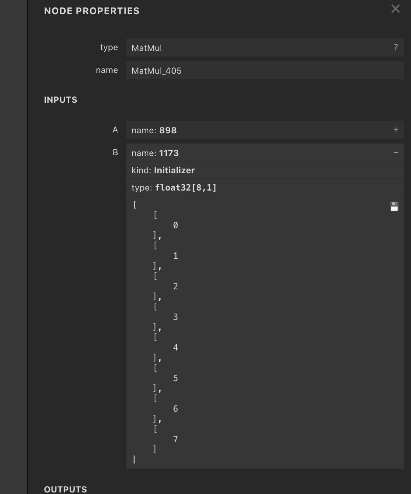

# nanodet.lite.ai.toolkit 🚀🚀🌟  

<div align='left'>
  
  
  
  
</div>


使用Lite.AI.ToolKit C++工具箱来跑NanoDet的一些案例(https://github.com/DefTruth/lite.ai.toolkit) ，ONNXRuntime、MNN、NCNN和TNN四个版本。

<div align='center'>
  
  
  
  

</div>   

若是有用，❤️不妨给个⭐️🌟支持一下吧~ 🙃🤪🍀

## 2. C++版本源码

nanodet C++ 版本的源码包含ONNXRuntime、MNN、NCNN和TNN四个版本，可以在 [lite.ai.toolkit](https://github.com/DefTruth/lite.ai.toolkit) 工具箱中找到。本项目主要介绍如何基于 [lite.ai.toolkit](https://github.com/DefTruth/lite.ai.toolkit) 工具箱，直接使用nanodet来跑目标检测。需要说明的是，本项目是基于MacOS下编译的 [liblite.ai.toolkit.v0.1.0.dylib](https://github.com/DefTruth/nanodet.lite.ai.toolkit/blob/main/lite.ai.toolkit/lib) 来实现的，对于使用MacOS的用户，可以直接下载本项目包含的*liblite.ai.toolkit.v0.1.0*动态库和其他依赖库进行使用。而非MacOS用户，则需要从[lite.ai.toolkit](https://github.com/DefTruth/lite.ai.toolkit) 中下载源码进行编译。[lite.ai.toolkit](https://github.com/DefTruth/lite.ai.toolkit) c++工具箱的编译已经在MacOS/Linux/Windows下编译测试通过，支持CPU和GPU环境，目前包含70+流行的开源模型。
* [nanodet.cpp](https://github.com/DefTruth/lite.ai.toolkit/blob/main/lite/ort/cv/nanodet.cpp)
* [nanodet.h](https://github.com/DefTruth/lite.ai.toolkit/blob/main/lite/ort/cv/nanodet.h)  
* [mnn_nanodet.cpp](https://github.com/DefTruth/lite.ai.toolkit/blob/main/lite/mnn/cv/mnn_nanodet.cpp)
* [mnn_nanodet.h](https://github.com/DefTruth/lite.ai.toolkit/blob/main/lite/mnn/cv/mnn_nanodet.h)
* [tnn_nanodet.cpp](https://github.com/DefTruth/lite.ai.toolkit/blob/main/lite/tnn/cv/tnn_nanodet.cpp)
* [tnn_nanodet.h](https://github.com/DefTruth/lite.ai.toolkit/blob/main/lite/tnn/cv/tnn_nanodet.h)
* [ncnn_nanodet.cpp](https://github.com/DefTruth/lite.ai.toolkit/blob/main/lite/ncnn/cv/ncnn_nanodet.cpp)
* [ncnn_nanodet.h](https://github.com/DefTruth/lite.ai.toolkit/blob/main/lite/ncnn/cv/ncnn_nanodet.h)

ONNXRuntime C++、MNN、TNN和NCNN版本的推理实现均已测试通过，欢迎白嫖~

## 3. 模型文件

### 3.1 ONNX模型文件
可以从我提供的链接下载 ([Baidu Drive](https://pan.baidu.com/s/1elUGcx7CZkkjEoYhTMwTRQ) code: 8gin) , 也可以从本直接仓库下载。需要注意的是，为了便于C++工程的实现，我对nanodet官方的nanodet_head.py 和 gfl_head.py的源码进行了一些修改。如果你想要自己转换onnx文件，可以使用我fork的分支👉[DefTruth/nanodet](https://github.com/DefTruth/nanodet).   


|                 Class                 |      Pretrained ONNX Files      |              Rename or Converted From (Repo)              | Size  |
| :-----------------------------------: | :-----------------------------: | :-------------------------------------------------------: | :---: |  
| *lite::cv::detection::NanoDet* |    [nanodet_m_0.5x.onnx](https://github.com/DefTruth/nanodet.lite.ai.toolkit/blob/main/examples/hub/onnx/cv)     |       [nanodet](https://github.com/RangiLyu/nanodet)       | 1.1Mb  |
| *lite::cv::detection::NanoDet* |    [nanodet_m.onnx](https://github.com/DefTruth/nanodet.lite.ai.toolkit/blob/main/examples/hub/onnx/cv)     |       [nanodet](https://github.com/RangiLyu/nanodet)       | 3.6Mb  |
| *lite::cv::detection::NanoDet* |    [nanodet_m_1.5x.onnx](https://github.com/DefTruth/nanodet.lite.ai.toolkit/blob/main/examples/hub/onnx/cv)     |       [nanodet](https://github.com/RangiLyu/nanodet)       | 7.9Mb  |
| *lite::cv::detection::NanoDet* |    [nanodet_m_1.5x_416.onnx](https://github.com/DefTruth/nanodet.lite.ai.toolkit/blob/main/examples/hub/onnx/cv)     |       [nanodet](https://github.com/RangiLyu/nanodet)       | 7.9Mb  |
| *lite::cv::detection::NanoDet* |    [nanodet_m_416.onnx](https://github.com/DefTruth/nanodet.lite.ai.toolkit/blob/main/examples/hub/onnx/cv)     |       [nanodet](https://github.com/RangiLyu/nanodet)       | 3.6Mb  |
| *lite::cv::detection::NanoDet* |    [nanodet_g.onnx](https://github.com/DefTruth/nanodet.lite.ai.toolkit/blob/main/examples/hub/onnx/cv)     |       [nanodet](https://github.com/RangiLyu/nanodet)       | 14Mb  |
| *lite::cv::detection::NanoDet* |    [nanodet_t.onnx](https://github.com/DefTruth/nanodet.lite.ai.toolkit/blob/main/examples/hub/onnx/cv)     |       [nanodet](https://github.com/RangiLyu/nanodet)       | 5.1Mb  |
| *lite::cv::detection::NanoDet* |    [nanodet-RepVGG-A0_416.onnx](https://github.com/DefTruth/nanodet.lite.ai.toolkit/blob/main/examples/hub/onnx/cv)     |       [nanodet](https://github.com/RangiLyu/nanodet)       | 26Mb  |
| *lite::cv::detection::NanoDetEfficientNetLite* |    [nanodet-EfficientNet-Lite0_320.onnx](https://github.com/DefTruth/nanodet.lite.ai.toolkit/blob/main/examples/hub/onnx/cv)     |       [nanodet](https://github.com/RangiLyu/nanodet)       | 12Mb  |
| *lite::cv::detection::NanoDetEfficientNetLite* |    [nanodet-EfficientNet-Lite1_416.onnx](https://github.com/DefTruth/nanodet.lite.ai.toolkit/blob/main/examples/hub/onnx/cv)     |       [nanodet](https://github.com/RangiLyu/nanodet)       | 15Mb  |
| *lite::cv::detection::NanoDetEfficientNetLite* |    [nanodet-EfficientNet-Lite2_512.onnx](https://github.com/DefTruth/nanodet.lite.ai.toolkit/blob/main/examples/hub/onnx/cv)     |       [nanodet](https://github.com/RangiLyu/nanodet)       | 18Mb  |  

### 3.2 MNN模型文件 
MNN模型文件下载地址，([Baidu Drive](https://pan.baidu.com/s/1KyO-bCYUv6qPq2M8BH_Okg) code: 9v63)

|                 Class                 |      Pretrained MNN Files      |              Rename or Converted From (Repo)              | Size  |
| :-----------------------------------: | :-----------------------------: | :-------------------------------------------------------: | :---: |
| *lite::mnn::cv::detection::NanoDet* |    nanodet_m_0.5x.mnn     |       [nanodet](https://github.com/RangiLyu/nanodet)       | 1.1Mb  |
| *lite::mnn::cv::detection::NanoDet* |    nanodet_m.mnn     |       [nanodet](https://github.com/RangiLyu/nanodet)       | 3.6Mb  |
| *lite::mnn::cv::detection::NanoDet* |    nanodet_m_1.5x.mnn     |       [nanodet](https://github.com/RangiLyu/nanodet)       | 7.9Mb  |
| *lite::mnn::cv::detection::NanoDet* |    nanodet_m_1.5x_416.mnn     |       [nanodet](https://github.com/RangiLyu/nanodet)       | 7.9Mb  |
| *lite::mnn::cv::detection::NanoDet* |    nanodet_m_416.mnn     |       [nanodet](https://github.com/RangiLyu/nanodet)       | 3.6Mb  |
| *lite::mnn::cv::detection::NanoDet* |    nanodet_g.mnn     |       [nanodet](https://github.com/RangiLyu/nanodet)       | 14Mb  |
| *lite::mnn::cv::detection::NanoDet* |    nanodet_t.mnn     |       [nanodet](https://github.com/RangiLyu/nanodet)       | 5.1Mb  |
| *lite::mnn::cv::detection::NanoDet* |    nanodet-RepVGG-A0_416.mnn     |       [nanodet](https://github.com/RangiLyu/nanodet)       | 26Mb  |
| *lite::mnn::cv::detection::NanoDetEfficientNetLite* |    nanodet-EfficientNet-Lite0_320.mnn     |       [nanodet](https://github.com/RangiLyu/nanodet)       | 12Mb  |
| *lite::mnn::cv::detection::NanoDetEfficientNetLite* |    nanodet-EfficientNet-Lite1_416.mnn     |       [nanodet](https://github.com/RangiLyu/nanodet)       | 15Mb  |
| *lite::mnn::cv::detection::NanoDetEfficientNetLite* |    nanodet-EfficientNet-Lite2_512.mnn     |       [nanodet](https://github.com/RangiLyu/nanodet)

### 3.3 TNN模型文件
TNN模型文件下载地址，([Baidu Drive](https://pan.baidu.com/s/1lvM2YKyUbEc5HKVtqITpcw) code: 6o6k)

|                 Class                 |      Pretrained TNN Files      |              Rename or Converted From (Repo)              | Size  |
| :-----------------------------------: | :-----------------------------: | :-------------------------------------------------------: | :---: |
| *lite::tnn::cv::detection::NanoDet* |    nanodet_m_0.5x.opt.tnnproto&tnnmodel     |       [nanodet](https://github.com/RangiLyu/nanodet)       | 1.1Mb  |
| *lite::tnn::cv::detection::NanoDet* |    nanodet_m.opt.tnnproto&tnnmodel     |       [nanodet](https://github.com/RangiLyu/nanodet)       | 3.6Mb  |
| *lite::tnn::cv::detection::NanoDet* |    nanodet_m_1.5x.opt.tnnproto&tnnmodel     |       [nanodet](https://github.com/RangiLyu/nanodet)       | 7.9Mb  |
| *lite::tnn::cv::detection::NanoDet* |    nanodet_m_1.5x_416.opt.tnnproto&tnnmodel     |       [nanodet](https://github.com/RangiLyu/nanodet)       | 7.9Mb  |
| *lite::tnn::cv::detection::NanoDet* |    nanodet_m_416.opt.tnnproto&tnnmodel     |       [nanodet](https://github.com/RangiLyu/nanodet)       | 3.6Mb  |
| *lite::tnn::cv::detection::NanoDet* |    nanodet_g.opt.tnnproto&tnnmodel     |       [nanodet](https://github.com/RangiLyu/nanodet)       | 14Mb  |
| *lite::tnn::cv::detection::NanoDet* |    nanodet_t.opt.tnnproto&tnnmodel     |       [nanodet](https://github.com/RangiLyu/nanodet)       | 5.1Mb  |
| *lite::tnn::cv::detection::NanoDet* |    nanodet-RepVGG-A0_416.opt.tnnproto&tnnmodel     |       [nanodet](https://github.com/RangiLyu/nanodet)       | 26Mb  |
| *lite::tnn::cv::detection::NanoDetEfficientNetLite* |    nanodet-EfficientNet-Lite0_320.opt.tnnproto&tnnmodel     |       [nanodet](https://github.com/RangiLyu/nanodet)       | 12Mb  |
| *lite::tnn::cv::detection::NanoDetEfficientNetLite* |    nanodet-EfficientNet-Lite1_416.opt.tnnproto&tnnmodel     |       [nanodet](https://github.com/RangiLyu/nanodet)       | 15Mb  |
| *lite::tnn::cv::detection::NanoDetEfficientNetLite* |    nanodet-EfficientNet-Lite2_512.opt.tnnproto&tnnmodel     |       [nanodet](https://github.com/RangiLyu/nanodet)       | 18Mb  |

### 3.4 NCNN模型文件  
NCNN模型文件下载地址，([Baidu Drive](https://pan.baidu.com/s/1hlnqyNsFbMseGFWscgVhgQ) code: sc7f)

|                 Class                 |      Pretrained NCNN Files      |              Rename or Converted From (Repo)              | Size  |
| :-----------------------------------: | :-----------------------------: | :-------------------------------------------------------: | :---: |
| *lite::ncnn::cv::detection::NanoDet* |    nanodet_m_0.5x-opt.param&bin     |       [nanodet](https://github.com/RangiLyu/nanodet)       | 1.1Mb  |
| *lite::ncnn::cv::detection::NanoDet* |    nanodet_m-opt.param&bin     |       [nanodet](https://github.com/RangiLyu/nanodet)       | 3.6Mb  |
| *lite::ncnn::cv::detection::NanoDet* |    nanodet_m_1.5x-opt.param&bin     |       [nanodet](https://github.com/RangiLyu/nanodet)       | 7.9Mb  |
| *lite::ncnn::cv::detection::NanoDet* |    nanodet_m_1.5x_416-opt.param&bin     |       [nanodet](https://github.com/RangiLyu/nanodet)       | 7.9Mb  |
| *lite::ncnn::cv::detection::NanoDet* |    nanodet_m_416-opt.param&bin     |       [nanodet](https://github.com/RangiLyu/nanodet)       | 3.6Mb  |
| *lite::ncnn::cv::detection::NanoDet* |    nanodet_g-opt.param&bin     |       [nanodet](https://github.com/RangiLyu/nanodet)       | 14Mb  |
| *lite::ncnn::cv::detection::NanoDet* |    nanodet_t-opt.param&bin     |       [nanodet](https://github.com/RangiLyu/nanodet)       | 5.1Mb  |
| *lite::ncnn::cv::detection::NanoDet* |    nanodet-RepVGG-A0_416-opt.param&bin     |       [nanodet](https://github.com/RangiLyu/nanodet)       | 26Mb  |
| *lite::ncnn::cv::detection::NanoDetEfficientNetLite* |    nanodet-EfficientNet-Lite0_320-opt.param&bin     |       [nanodet](https://github.com/RangiLyu/nanodet)       | 12Mb  |
| *lite::ncnn::cv::detection::NanoDetEfficientNetLite* |    nanodet-EfficientNet-Lite1_416-opt.param&bin     |       [nanodet](https://github.com/RangiLyu/nanodet)       | 15Mb  |
| *lite::ncnn::cv::detection::NanoDetEfficientNetLite* |    nanodet-EfficientNet-Lite2_512-opt.param&bin     |       [nanodet](https://github.com/RangiLyu/nanodet)       | 18Mb  |
| *lite::ncnn::cv::detection::NanoDetDepreciated* |    nanodet_m_0.5x-depreciated-opt.param&bin     |       [nanodet](https://github.com/RangiLyu/nanodet)       | 1.1Mb  |
| *lite::ncnn::cv::detection::NanoDetDepreciated* |    nanodet_m-depreciated-opt.param&bin     |       [nanodet](https://github.com/RangiLyu/nanodet)       | 3.6Mb  |
| *lite::ncnn::cv::detection::NanoDetDepreciated* |    nanodet_m_1.5x-depreciated-opt.param&bin     |       [nanodet](https://github.com/RangiLyu/nanodet)       | 7.9Mb  |
| *lite::ncnn::cv::detection::NanoDetDepreciated* |    nanodet_m_1.5x_416-depreciated-opt.param&bin     |       [nanodet](https://github.com/RangiLyu/nanodet)       | 7.9Mb  |
| *lite::ncnn::cv::detection::NanoDetDepreciated* |    nanodet_m_416-depreciated-opt.param&bin     |       [nanodet](https://github.com/RangiLyu/nanodet)       | 3.6Mb  |
| *lite::ncnn::cv::detection::NanoDetDepreciated* |    nanodet_g-depreciated-opt.param&bin     |       [nanodet](https://github.com/RangiLyu/nanodet)       | 14Mb  |
| *lite::ncnn::cv::detection::NanoDetDepreciated* |    nanodet_t-depreciated-opt.param&bin     |       [nanodet](https://github.com/RangiLyu/nanodet)       | 5.1Mb  |
| *lite::ncnn::cv::detection::NanoDetDepreciated* |    nanodet-RepVGG-A0_416-depreciated-opt.param&bin     |       [nanodet](https://github.com/RangiLyu/nanodet)       | 26Mb  |
| *lite::ncnn::cv::detection::NanoDetEfficientNetLiteDepreciated* |    nanodet-EfficientNet-Lite0_320-depreciated-opt.param&bin     |       [nanodet](https://github.com/RangiLyu/nanodet)       | 12Mb  |
| *lite::ncnn::cv::detection::NanoDetEfficientNetLiteDepreciated* |    nanodet-EfficientNet-Lite1_416-depreciated-opt.param&bin     |       [nanodet](https://github.com/RangiLyu/nanodet)       | 15Mb  |
| *lite::ncnn::cv::detection::NanoDetEfficientNetLiteDepreciated* |    nanodet-EfficientNet-Lite2_512-depreciated-opt.param&bin     |       [nanodet](https://github.com/RangiLyu/nanodet)       | 18Mb  |

## 4. 修改源码

### 4.1 修改Internal

在👉[DefTruth/nanodet](https://github.com/DefTruth/nanodet) 中我把distribution_project部分的操作也进行了ONNX导出，为此，我对Internal的原始实现进行了修改，使其能够与ONNX的算子兼容。Internal整体的思路不变，但我修改了`project`的buffer注册部分，原来`project`注册的代码是这样的：  
```python
 self.register_buffer(
      "project", torch.linspace(0, self.reg_max, self.reg_max + 1)
 )
```  
这部分代码有2个小问题，会导致ONNX导出后，无法被ONNXRuntime加载。其一是，torch.linspace没有被[torch.onnx.export](https://pytorch.org/docs/stable/onnx.html#supported-operators) 直接支持，导出后可能会发生错误。其二是，`project`并没有被显式地注册成二维的矩阵，而是一个一维向量，这会导致转换出来的ONNX文件加载失败，因为张量的维度没有对齐。我们可以看到Internal中的forward使用了F.linear：
```python
 x = F.softmax(x.reshape(-1, self.reg_max + 1), dim=1)
 x = F.linear(x, self.project.type_as(x)).reshape(-1, 4)
```  
查看F.linear文档，这实际上是在做两个矩阵相乘：  
```python
def linear(input: Tensor, weight: Tensor, bias: Optional[Tensor] = None) -> Tensor:
    r"""
    Applies a linear transformation to the incoming data: :math:`y = xA^T + b`.

    This operator supports :ref:`TensorFloat32<tf32_on_ampere>`.

    Shape:

        - Input: :math:`(N, *, in\_features)` N is the batch size, `*` means any number of
          additional dimensions
        - Weight: :math:`(out\_features, in\_features)`
        - Bias: :math:`(out\_features)`
        - Output: :math:`(N, *, out\_features)`
    """
```
Internal中的`project`就是linear用到的参数`Weight`，需要是一个矩阵的形式。在PyTorch中直接使用一维向量来相乘，也没有报错，我想这主要归功于PyTorch的自动broadcast功能，它自能地把维度对齐了。然而，这种broadcast的行为，并没有被ONNX很好地支持，在转换ONNX文件后，就会出问题。因此，最好的方式就是对Internal进行修改，这是一个不带可学习参数的操作，完全可以动刀。
* 使用torch.arange替换torch.linspace，torch.arange被[torch.onnx.export](https://pytorch.org/docs/stable/onnx.html#supported-operators) 直接支持  
* 在对`project`进行buffer注册时，使用显式的维度设置，而非隐式的维度设置。  
修改后的buffer注册代码如下：  
  
```python
self.register_buffer(
    "project",
    torch.arange(0, self.reg_max + 1).reshape(1, self.reg_max + 1)
)
```  

### 4.2 导出distribution_project  
什么是distribution_project？这个需要小伙伴们去看一下[nanodet作者的详细解析](https://zhuanlan.zhihu.com/p/306530300) 和 [大白话 Generalized Focal Loss](https://zhuanlan.zhihu.com/p/147691786) 这两篇文章了。简单来说就是，一般的目标检测都是直接回归边框相对于某个指定长度的偏移量或相对量，但是GFL和nanodet不这么干，因为这样非常不flexible，在复杂场景中，边界框的表示具有很强的不确定性，而现有的框回归本质都是建模了非常单一的狄拉克分布。GFL的作者希望用一种general的分布去建模边界框的表示，工程上的实现就是，预测边框大小在(0,1,2,...,n=7|8|9|...)上的概率分布，然后再采用一个求和公式得到最后的结果。如下图所示（比如被水模糊掉的滑板，以及严重遮挡的大象）

<div align='center'>
  
</div>   

<div align='center'>
  
</div>   

在nanodet的原始实现中，ONNX导出时，是不导出distribution_project部分的，原来的代码如下：  
```python
# 原来的nanodet_head.py中onnx导出相关的部分  
if torch.onnx.is_in_onnx_export():
  cls_score = (
    torch.sigmoid(cls_score)
      .reshape(1, self.num_classes, -1)
      .permute(0, 2, 1)
  )
  bbox_pred = bbox_pred.reshape(1, (self.reg_max + 1) * 4, -1).permute(
    0, 2, 1
  )
return cls_score, bbox_pred
```
而且如果直接使用原来的Internal实现，就算导出了也没法用。于是，就只能在C++侧手动撸Softmax和MatMul的逻辑。这对于我这种懒人来说，显然是个噩梦。能用python搞定的事情，就不要用C++来搞了。在经过对Internal的一番修改后，现在已经可以成功地导出distribution_project操作了，这样就可以直接利用推理引擎本身实现的Softmax和MatMul算子了。修改后的代码为：  
```python
if torch.onnx.is_in_onnx_export():
  cls_score = (
    torch.sigmoid(cls_score)
      .reshape(1, self.num_classes, -1)
      .permute(0, 2, 1)
  )
  bbox_pred = bbox_pred.reshape(1, (self.reg_max + 1) * 4, -1).permute(
    0, 2, 1
  )
  # 只需要添加这一句
  bbox_pred = self.distribution_project(bbox_pred).unsqueeze(0)
return cls_score, bbox_pred

```  
那么，bbox_pred导出后的维度是(1,?=1600|400|100|...,4)，这里的?表示的是框的个数，4表示的(l,t,r,b)，即分别框的四条边距离中心的距离，left、top、right和bottom。导出后的ONNX模型文件的结构如下：  

<div align='center'>
  
</div>   

可以看到，distribution_project操作已经被转换成Softmax和MatMul两个算子。而在Internal中注册的`project`也被当做了常量作为MatMul算子的输入。  

<div align='center'>
  
</div>   


## 4. 接口文档

在[lite.ai.toolkit](https://github.com/DefTruth/lite.ai.toolkit) 中，nanodet的实现类为：

```c++
class LITE_EXPORTS lite::cv::detection::NanoDet;
class LITE_EXPORTS lite::cv::detection::NanoDetEfficientNetLite;
class LITE_EXPORTS lite::mnn::cv::detection::NanoDet;
class LITE_EXPORTS lite::mnn::cv::detection::NanoDetEfficientNetLite;
class LITE_EXPORTS lite::tnn::cv::detection::NanoDet;
class LITE_EXPORTS lite::tnn::cv::detection::NanoDetEfficientNetLite;
class LITE_EXPORTS lite::ncnn::cv::detection::NanoDet;
class LITE_EXPORTS lite::ncnn::cv::detection::NanoDetEfficientNetLite;
```  
该类型目前包含1公共接口`detect`用于进行目标检测。由于EfficientNetLite版本的nanodet前处理和其他版本的不一致，我为了保持Lite.AI.ToolKit中初始化风格的一致性，这里使用两个类分别实现了nanodet的C++封装。
```c++
public:
    /**
     * @param mat cv::Mat BGR format
     * @param detected_boxes vector of Boxf to catch detected boxes.
     * @param score_threshold default 0.45f, only keep the result which >= score_threshold.
     * @param iou_threshold default 0.3f, iou threshold for NMS.
     * @param topk default 100, maximum output boxes after NMS.
     * @param nms_type the method.
     */
    void detect(const cv::Mat &mat, std::vector<types::Boxf> &detected_boxes,
                float score_threshold = 0.45f, float iou_threshold = 0.3f,
                unsigned int topk = 100, unsigned int nms_type = NMS::OFFSET);
```
`detect`接口的输入参数说明：  
* mat: cv::Mat类型，BGR格式。  
* detected_boxes: Boxf向量，包含被检测到的框，Boxf中包含x1,y1,x2,y2,label,score等成员  
* score_threshold：分类得分（质量得分）阈值，默认0.45，小于该阈值的框将被丢弃。  
* iou_threshold：NMS中的iou阈值，默认0.3。
* topk：默认100，只保留前k个检测到的结果。
* nms_type：NMS算法的类型，默认为不同的类别各自做NMS。 

## 5. 使用案例
这里测试使用的是nanodet_m.onnx版本的模型，你可以尝试使用其他版本的模型。  

### 5.1 ONNXRuntime版本
```c++
#include "lite/lite.h"

static void test_nanodet()
{
    std::string onnx_path = "../hub/onnx/cv/nanodet_m.onnx";
    std::string test_img_path = "../resources/9.jpg";
    std::string save_img_path = "../logs/9.jpg";
    
    auto *nanodet = new lite::cv::detection::NanoDet(onnx_path);
    
    std::vector<lite::types::Boxf> detected_boxes;
    cv::Mat img_bgr = cv::imread(test_img_path);
    nanodet->detect(img_bgr, detected_boxes, 0.3f);
    
    lite::utils::draw_boxes_inplace(img_bgr, detected_boxes);
    
    cv::imwrite(save_img_path, img_bgr);
    
    std::cout << "Detected Boxes Num: " << detected_boxes.size() << std::endl;
    
    delete nanodet;

}
```  
### 5.2 MNN版本
```c++
#ifdef ENABLE_MNN
    std::string mnn_path = "../hub/mnn/cv/nanodet_m.mnn";
    std::string test_img_path = "../examples/lite/resources/9.jpg";
    std::string save_img_path = "../logs/9_mnn_2.jpg";
    
    // 3. Test Specific Engine MNN
    lite::mnn::cv::detection::NanoDet *nanodet =
    new lite::mnn::cv::detection::NanoDet(mnn_path);
    
    std::vector<lite::types::Boxf> detected_boxes;
    cv::Mat img_bgr = cv::imread(test_img_path);
    nanodet->detect(img_bgr, detected_boxes);
    
    lite::utils::draw_boxes_inplace(img_bgr, detected_boxes);
    cv::imwrite(save_img_path, img_bgr);
    
    std::cout << "MNN Version Detected Boxes Num: " << detected_boxes.size() << std::endl;
    
    delete nanodet;
#endif
```  

### 5.3 TNN版本
```c++
#ifdef ENABLE_TNN
    std::string proto_path = "../hub/tnn/cv/nanodet_m.opt.tnnproto";
    std::string model_path = "../hub/tnn/cv/nanodet_m.opt.tnnmodel";
    std::string test_img_path = "../examples/lite/resources/9.jpg";
    std::string save_img_path = "../logs/9_tnn_2.jpg";
    
    // 4. Test Specific Engine TNN
    lite::tnn::cv::detection::NanoDet *nanodet =
    new lite::tnn::cv::detection::NanoDet(proto_path, model_path);
    
    std::vector<lite::types::Boxf> detected_boxes;
    cv::Mat img_bgr = cv::imread(test_img_path);
    nanodet->detect(img_bgr, detected_boxes);
    
    lite::utils::draw_boxes_inplace(img_bgr, detected_boxes);
    cv::imwrite(save_img_path, img_bgr);
    
    std::cout << "TNN Version Detected Boxes Num: " << detected_boxes.size() << std::endl;
    
    delete nanodet;
#endif
```  

### 5.4 NCNN版本
```c++
#ifdef ENABLE_NCNN
    std::string param_path = "../hub/ncnn/cv/nanodet_m-opt.param";
    std::string bin_path = "../hub/ncnn/cv/nanodet_m-opt.bin";
    std::string test_img_path = "../examples/lite/resources/9.jpg";
    std::string save_img_path = "../logs/9_ncnn_2.jpg";
    
    // 4. Test Specific Engine NCNN
    lite::ncnn::cv::detection::NanoDet *nanodet =
    new lite::ncnn::cv::detection::NanoDet(
    param_path, bin_path,1, 320, 320);
    
    std::vector<lite::types::Boxf> detected_boxes;
    cv::Mat img_bgr = cv::imread(test_img_path);
    nanodet->detect(img_bgr, detected_boxes);
    
    lite::utils::draw_boxes_inplace(img_bgr, detected_boxes);
    cv::imwrite(save_img_path, img_bgr);
    
    std::cout << "NCNN Version Detected Boxes Num: " << detected_boxes.size() << std::endl;
    
    delete nanodet;
#endif
```  
* 输出结果为:  
<div align='center'>
  
  
  
  
  <br>  
  
  
  
  
</div>   

## 6. 编译运行
在MacOS下可以直接编译运行本项目，无需下载其他依赖库。其他系统则需要从[lite.ai.toolkit](https://github.com/DefTruth/lite.ai.toolkit) 中下载源码先编译*lite.ai.toolkit.v0.1.0*动态库。
```shell
git clone --depth=1 https://github.com/DefTruth/nanodet.lite.ai.toolkit.git
cd nanodet.lite.ai.toolkit 
sh ./build.sh
```  

* CMakeLists.txt设置
```cmake
cmake_minimum_required(VERSION 3.17)
project(nanodet.lite.ai.toolkit)

set(CMAKE_CXX_STANDARD 11)

# setting up lite.ai.toolkit
set(LITE_AI_DIR ${CMAKE_SOURCE_DIR}/lite.ai.toolkit)
set(LITE_AI_INCLUDE_DIR ${LITE_AI_DIR}/include)
set(LITE_AI_LIBRARY_DIR ${LITE_AI_DIR}/lib)
include_directories(${LITE_AI_INCLUDE_DIR})
link_directories(${LITE_AI_LIBRARY_DIR})

set(OpenCV_LIBS
        opencv_highgui
        opencv_core
        opencv_imgcodecs
        opencv_imgproc
        opencv_video
        opencv_videoio
        )
# add your executable
set(EXECUTABLE_OUTPUT_PATH ${CMAKE_SOURCE_DIR}/examples/build)

add_executable(lite_nanodet examples/test_lite_nanodet.cpp)
target_link_libraries(lite_nanodet
        lite.ai.toolkit
        onnxruntime
        MNN  # need, if built lite.ai.toolkit with ENABLE_MNN=ON,  default OFF
        ncnn # need, if built lite.ai.toolkit with ENABLE_NCNN=ON, default OFF
        TNN  # need, if built lite.ai.toolkit with ENABLE_TNN=ON,  default OFF
        ${OpenCV_LIBS})  # link lite.ai.toolkit & other libs.
```

* building && testing information:
```shell
--- Build files have been written to: /Users/xxx/Desktop/xxx/nanodet.lite.ai.toolkit/examples/build
[ 50%] Building CXX object CMakeFiles/lite_nanodet.dir/examples/test_lite_nanodet.cpp.o
[100%] Linking CXX executable lite_nanodet
[100%] Built target lite_nanodet
Testing Start ...
LITEORT_DEBUG LogId: ../hub/onnx/cv/nanodet_m.onnx
=============== Input-Dims ==============
input_node_dims: 1
input_node_dims: 3
input_node_dims: 320
input_node_dims: 320
=============== Output-Dims ==============
Output: 0 Name: cls_pred_stride_8 Dim: 0 :1
Output: 0 Name: cls_pred_stride_8 Dim: 1 :1600
Output: 0 Name: cls_pred_stride_8 Dim: 2 :80
Output: 1 Name: cls_pred_stride_16 Dim: 0 :1
Output: 1 Name: cls_pred_stride_16 Dim: 1 :400
Output: 1 Name: cls_pred_stride_16 Dim: 2 :80
Output: 2 Name: cls_pred_stride_32 Dim: 0 :1
Output: 2 Name: cls_pred_stride_32 Dim: 1 :100
Output: 2 Name: cls_pred_stride_32 Dim: 2 :80
Output: 3 Name: dis_pred_stride_8 Dim: 0 :1
Output: 3 Name: dis_pred_stride_8 Dim: 1 :1600
Output: 3 Name: dis_pred_stride_8 Dim: 2 :4
Output: 4 Name: dis_pred_stride_16 Dim: 0 :1
Output: 4 Name: dis_pred_stride_16 Dim: 1 :400
Output: 4 Name: dis_pred_stride_16 Dim: 2 :4
Output: 5 Name: dis_pred_stride_32 Dim: 0 :1
Output: 5 Name: dis_pred_stride_32 Dim: 1 :100
Output: 5 Name: dis_pred_stride_32 Dim: 2 :4
generate_bboxes num: 50
Detected Boxes Num: 9
Testing Successful !
```  

